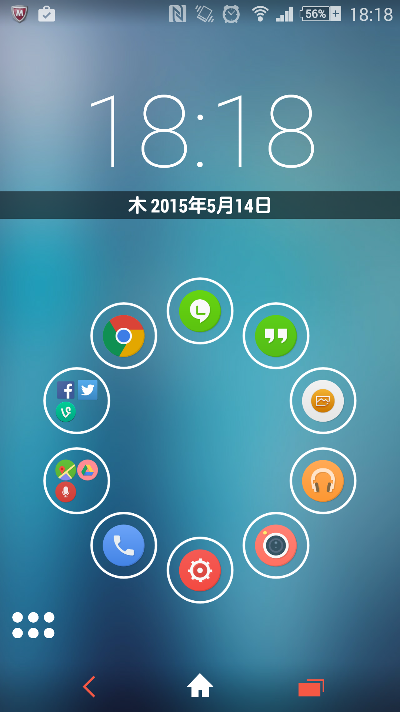
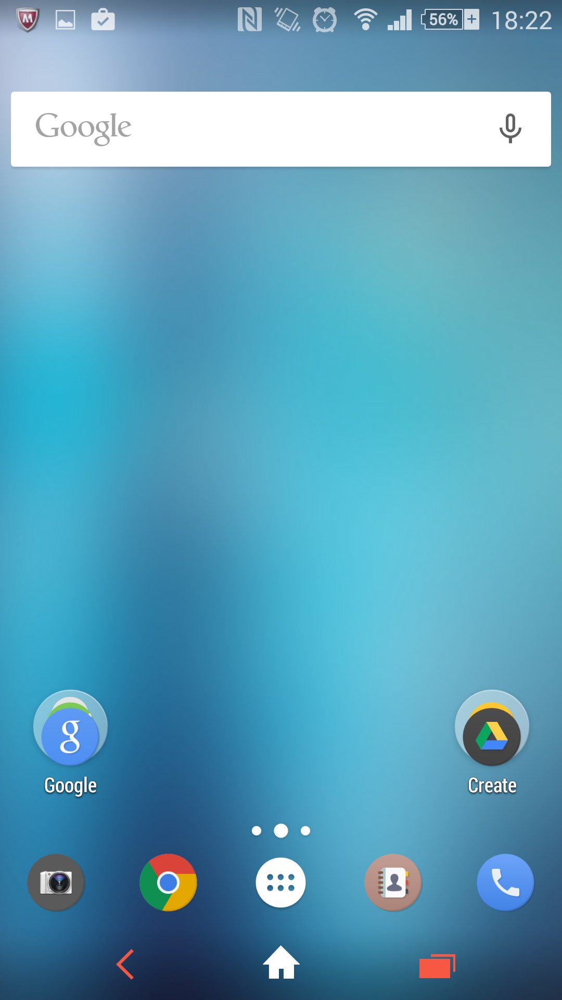
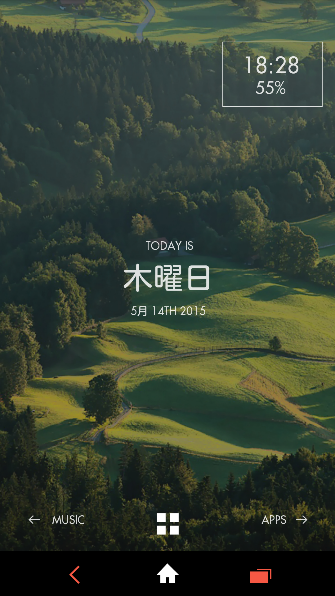

Today I customized my Android theme layout:

  - Launcher: Smart Launcher
  - Theme: Triflat
  - Icon pack: Numix Circle

  - Launcher: Nova Launcher
  - Theme: Triflat
  - Icon pack: Numix Circle

  - Launcher: Themer
  - Theme: Hills
  - Icon pack: Numix Circle

I'm liking the simplicity of Smart Launcher, but having just tried the Themer app, with a bunch of premade themes to choose from, I might find one I like.