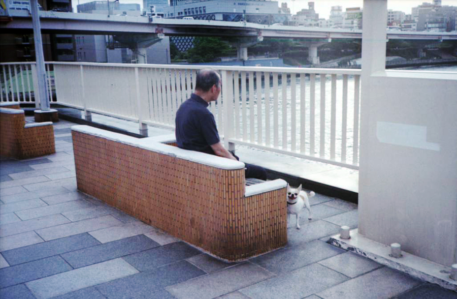

Moving down to Kansai isn't proving to be as simple as I'd expected.

Boss originally said "three months" is the standard period of notice, and that I had to find my own replacement. I thought "fuck you but I guess I'll try and find someone if it means I can get out quicker".

Two months later and still nobody, although we have another interview tomorrow.

Struggling to keep motivated in a company where there are no perks to the job, and I actually made big sacrifices to join in the first place. There have been no incentives to stay, no effort from the company to help out with me moving on, and frankly he's taking the piss thinking I'm just going to stay here even though I've already technically moved down to Kansai.

Each day I spend just doing the same old shit work at this shit job, I'm thinking more and more about just walking out. Fuck the notice period (which legally is nowhere near as long as three months) and fuck finding my own replacement. Recruitment was nowhere in my fucking contract.

In the meantime, a photo I found yesterday at [rsphototank.tumblr.com](http://rsphototank.tumblr.com).

I used to see guys like this all the time, just sitting and watching the boats on the Sumida-gawa. Musicians practicing and joggers taking a break. Morishita was a nice place.