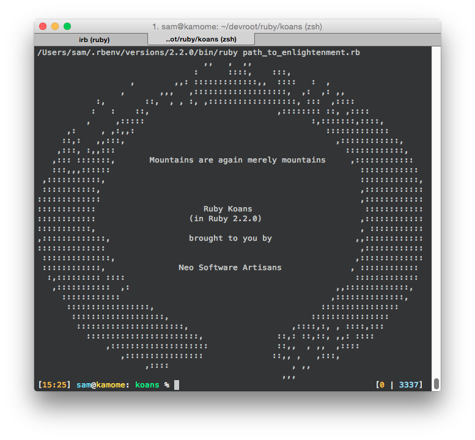

Completed the Ruby Koans earlier while I was supposed to be working.

I guess I should probably study something more seriously. I kept googling to a minumum, but after taking a big break between completing the exercises, I had to get a few things freshened up.

Was down in Kansai again over the weekend, it was nice to see a lot of old friends.

Not so fun coming back up to work at 5am, though.

Still, I'm happy I got to spend time with Kasumi from Fri-Mon.

More later.